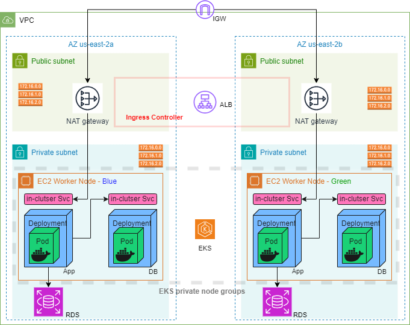

# EKS in a VPC, with ALB access and RDS connectivity along with CI/CD OIDC (GitHub Actions) using Terraform.

## Architecture

The following diagram shows the core resources that we will be creating in AWS.



A VPC will be created with 2 public subnets and 2 private Subnets in 2 different Availability Zones. Traffic from Private Subnets will route through the NAT Gateway and traffic from Public Subnets will route through the Internet Gateway.

Kubernetes Cluster Nodes will be created as part of Auto-Scaling groups and will reside in Private Subnets. The Application Load balancer will be created in the Public Subnets.

### Prerequisite

Before we proceed and provision EKS Cluster using Terraform, there are a few commands or tools you need to have in the server where you will be creating the cluster from.

    1. awscli

    2. Terraform

    3. kubectl

    4. helm

We assume that the aws cli configured - aws configure

## Quick Setup

Clone the repository:

    git clone https://github.com/arthur-abanda-ndjock/arthur-digiboard-terraform.git

### TF Backend & AWS Profile settings

Update the `backend.tf` , update the s3 bucket and the region of your s3 bucket. Update the profile if you are not using the default profile.

Update the `variables.tf` profile and region variables if you are not using the default profile or region used.

### Github Actions access to EKS using

In order for the Github Actions account to deploy apps on the eks cluster, authenticaction and authorization must be configured in the cluster.
The authenticaction is handled by having a user created in eks and having it mapped to an IAM identity. This is already done using 'aws_auth_roles' map in the 'vpc' module.

    ```
    module "vpc" {
    ...
        # aws-auth configmap
        manage_aws_auth_configmap = true
        aws_auth_roles = [
            # eks iamidentitymapping for github actions oicd user
            {
                rolearn  = var.rolearn
                username = "admin_github_oicd"
                groups   = ["system:bootstrappers", "system:nodes"]
            },
        ]
    }
    ```

kindly set the value for var.rolearn with your github actions aws role in the `variables.tf` file as environment variable TF_VAR_rolearn. The user default name is admin_github_oicd and its related authorization can be found in `modules/eks-cluster/gha_aws_oicd_k8s-role.tf`.
If there is no role to add, disable adding role to the configmap by commenting out the following field in `modules/eks-cluster/main.tf` (#manage_aws_auth_configmap = true)

## Running the project

Initialize the project to pull all the modules used

    terraform init

Validate that the project is correctly setup.

    terraform validate

Run the plan command to see all the resources that will be created

    terraform plan

When you ready, run the apply command to create the resources.

    terraform apply

## Components Setup.

### Setting up EKS

1. Create a VPC where to deploy the cluster. For this I used the [VPC module](https://registry.terraform.io/modules/terraform-aws-modules/vpc/aws/latest).

   ```
   module "vpc" {
   source  = "terraform-aws-modules/vpc/aws"
   version = "5.0.0"

   name = "eks-vpc"
   cidr = "10.0.0.0/16"

   providers = {
       aws = aws.us-east-2
   }

   azs = ["us-east-2a", "us-east-2b", "us-east-2c"]
   #private_subnets     = [for k, v in local.azs : cidrsubnet(local.vpc_cidr, 8, k)]
   #public_subnets      = [for k, v in local.azs : cidrsubnet(local.vpc_cidr, 8, k + 4)]
   private_subnets = ["10.0.1.0/24", "10.0.2.0/24", "10.0.3.0/24"]
   public_subnets  = ["10.0.101.0/24", "10.0.102.0/24", "10.0.103.0/24"]

   enable_nat_gateway = true

   public_subnet_tags = {
       "kubernetes.io/role/elb" = 1
   }

   private_subnet_tags = {
       "kubernetes.io/role/internal-elb" = 1
   }

   tags = {
       Terraform   = "true"
       Environment = "dev"
   }
   }
   ```

2. Create the EKS cluster using the [EKS terraform module](https://registry.terraform.io/modules/terraform-aws-modules/eks/aws/latest)

   ```
   module "eks" {
   source  = "terraform-aws-modules/eks/aws"
   version = "~> 19.0"

   cluster_name    = "tf-cluster"
   cluster_version = "1.27"

   providers = {
       aws = aws.us-east-2
   }

   cluster_endpoint_public_access = true

   create_kms_key              = false
   create_cloudwatch_log_group = false
   cluster_encryption_config   = {}

   cluster_addons = {
       coredns = {
       most_recent = true
       }
       kube-proxy = {
       most_recent = true
       }
       vpc-cni = {
       most_recent = true
       }
   }

   vpc_id                   = var.vpc_id
   subnet_ids               = var.private_subnets
   control_plane_subnet_ids = var.private_subnets

   # EKS Managed Node Group(s)
   eks_managed_node_group_defaults = {
       instance_types = ["m5.xlarge", "m5.large", "t3.medium"]
   }

   eks_managed_node_groups = {
       blue = {}
       green = {
       min_size     = 1
       max_size     = 10
       desired_size = 1

       instance_types = ["t3.large"]
       capacity_type  = "SPOT"
       }
   }

   tags = {
       env       = "dev"
       terraform = "true"
   }
   }
   ```

### Adding the Load Balancer Controller

Before we can install the Application load balancer controller, we need to create a role, policy and service account that the controller Will use.

1. We create a role using the module [iam-role-for-service-accounts-eks](https://github.com/terraform-aws-modules/terraform-aws-iam/tree/master/examples/iam-role-for-service-accounts-eks) which will create the required policy when attach_load_balancer_controller_policy is set to true.

   ```
   module "lb_role" {
   source = "terraform-aws-modules/iam/aws//modules/iam-role-for-service-accounts-eks"

   role_name                              = "${var.env_name}_eks_lb"
   attach_load_balancer_controller_policy = true

   oidc_providers = {
       main = {
       provider_arn               = var.oidc_provider_arn
       namespace_service_accounts = ["kube-system:aws-load-balancer-controller"]
       }
   }
   }
   ```

2. We create a service account that is annotated with the role created in the above step.

   ```
   resource "kubernetes_service_account" "service-account" {
   metadata {
       name      = "aws-load-balancer-controller"
       namespace = "kube-system"
       labels = {
       "app.kubernetes.io/name"      = "aws-load-balancer-controller"
       "app.kubernetes.io/component" = "controller"
       }
       annotations = {
       "eks.amazonaws.com/role-arn"               = module.lb_role.iam_role_arn
       "eks.amazonaws.com/sts-regional-endpoints" = "true"
       }
   }
   }
   ```

3. Finally we install the AWS load balancer controller.

   ```
   resource "helm_release" "alb-controller" {
   name       = "aws-load-balancer-controller"
   repository = "https://aws.github.io/eks-charts"
   chart      = "aws-load-balancer-controller"
   namespace  = "kube-system"
   depends_on = [
       kubernetes_service_account.service-account
   ]

   set {
       name  = "region"
       value = var.main-region
   }

   set {
       name  = "vpcId"
       value = var.vpc_id
   }

   set {
       name  = "image.repository"
       value = "602401143452.dkr.ecr.${var.main-region}.amazonaws.com/amazon/aws-load-balancer-controller"
   }

   set {
       name  = "serviceAccount.create"
       value = "false"
   }

   set {
       name  = "serviceAccount.name"
       value = "aws-load-balancer-controller"
   }

   set {
       name  = "clusterName"
       value = var.cluster_name
   }
   }
   ```

### Setting up RDS and connectivity to EKS

In `modules/eks-cluster/main.tf` are the following resources created:

- the DB instance
- its network config (security groups, subnets)
- its replicas
- its monitoring
- the eks IRSA with its config

## Cleanup the Resources we Created

When we are done testing the setup and don't require the resources created anymore, we can use the steps below to remove them.

    1.1 terraform init

    1.2 terraform destroy

If you get errors deleting the resources, remove the .terraform folder and destroy again.

    2.1 rm -rf .terraform

    2.2 terraform destroy

## Conclusion

Elastic Kubernetes Service (EKS) is a managed Kubernetes service provided by AWS, which takes the complexity and overhead out of provisioning and optimizing a Kubernetes Cluster for development teams.
The above method is just one of the method that can be used to create the EKS clusters and there can be a variety of methods;

Throughout the following setup, I was inspired by from the following sources:

- [1] Skanyi terraform-projects repo - https://github.com/Skanyi/terraform-projects
- [2] EKS connectivity to RDS using IRSA - https://dev.to/stack-labs/securing-the-connectivity-between-amazon-eks-and-amazon-rds-part-5-1coh
- [3] IAM Role for Service Accounts in EKS - https://github.com/terraform-aws-modules/terraform-aws-iam/tree/master/examples/iam-role-for-service-accounts-eks<br>
- [4] AWS VPC Terraform module - https://registry.terraform.io/modules/terraform-aws-modules/vpc/aws/latest<br>
- [5] AWS EKS Terraform module - https://registry.terraform.io/modules/terraform-aws-modules/eks/aws/latest<br>
